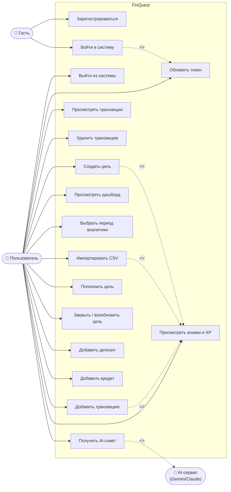

# Диаграмма вариантов использования (Use Case Diagram)

## Описание вариантов использования

| UC | Название | Актор | Предусловие | Основной сценарий |
|----|----------|-------|-------------|-------------------|
| UC1 | Регистрация | Гость | Email не занят | Ввести email+пароль → POST /auth/register → получить токены |
| UC2 | Вход | Гость | Аккаунт существует | Ввести email+пароль → POST /auth/login → получить токены |
| UC3 | Обновление токена | Система | Access token истёк | Axios interceptor → POST /auth/refresh → новый access token |
| UC4 | Выход | Пользователь | Авторизован | Очистить localStorage → редирект на /login |
| UC5 | Добавить транзакцию | Пользователь | Авторизован | Форма → POST /transactions → +10 XP → проверка ачивок |
| UC6 | Просмотр транзакций | Пользователь | Авторизован | GET /transactions?limit=20&offset=N → пагинированный список |
| UC7 | Удалить транзакцию | Пользователь | Транзакция существует | Подтверждение → DELETE /transactions/:id |
| UC8 | Импорт CSV | Пользователь | Авторизован | Загрузить файл → POST /transactions/import → +5 XP за запись |
| UC9 | Дашборд | Пользователь | Авторизован | GET /analytics/summary + /over-time → визуализация |
| UC10 | Период аналитики | Пользователь | На дашборде | Выбрать all/1y/6m/YYYY-MM → перезапрос с параметрами |
| UC11 | Создать цель | Пользователь | Авторизован | Форма → POST /goals → +20 XP (первая цель) |
| UC12 | Пополнить цель | Пользователь | Цель активна | PATCH /goals/:id (current_amount += delta) |
| UC13 | Закрыть цель | Пользователь | Цель активна | PATCH /goals/:id (completed=true) → completed_at=NOW() |
| UC14 | Добавить депозит | Пользователь | Авторизован | Форма → POST /investments/deposits |
| UC15 | Добавить кредит | Пользователь | Авторизован | Форма → POST /credits |
| UC16 | AI-совет | Пользователь | Авторизован | GET /ai/advice → LLM или rule-based → текст совета |
| UC17 | Ачивки и XP | Пользователь | Авторизован | GET /gamification/profile → список ачивок + XP + уровень |
