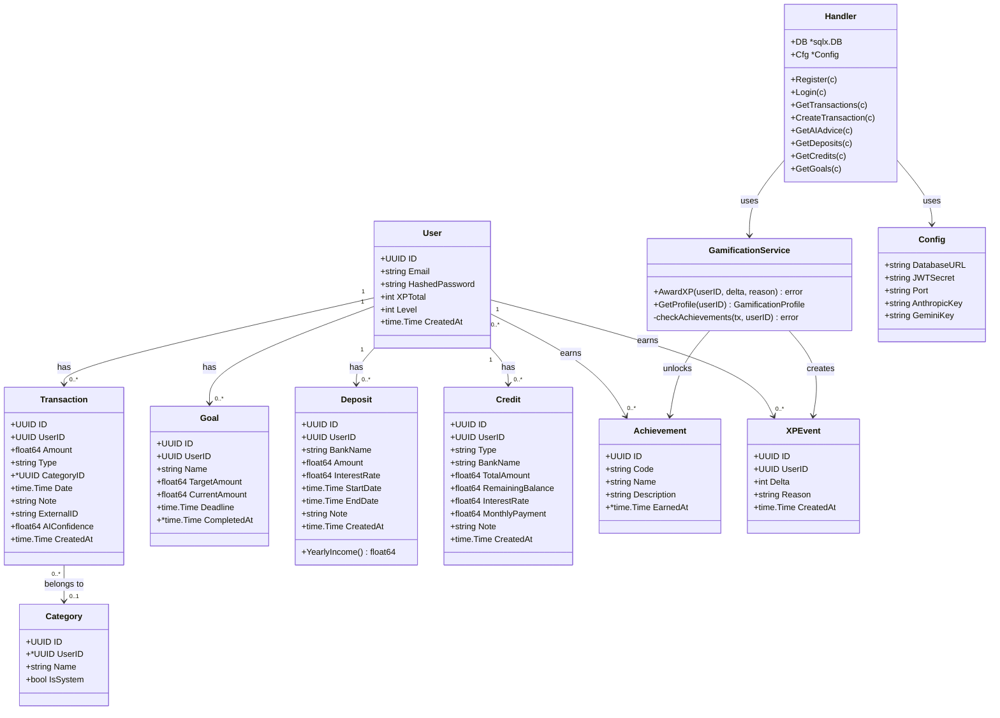

# Диаграмма классов (Class Diagram)

## Пакеты (Go packages)

| Пакет | Классы / Структуры | Ответственность |
|-------|-------------------|----------------|
| `models` | User, Transaction, Category, Goal, Deposit, Credit, Achievement | Структуры данных, соответствующие таблицам БД |
| `handlers` | Handler | HTTP-хендлеры, разбор запросов, формирование ответов |
| `services` | GamificationService | Бизнес-логика XP, уровней, ачивок |
| `config` | Config | Загрузка переменных окружения |
| `middleware` | AuthMiddleware | Проверка JWT, установка userID в контекст |
| `db` | — | Подключение к PostgreSQL (sqlx) |
