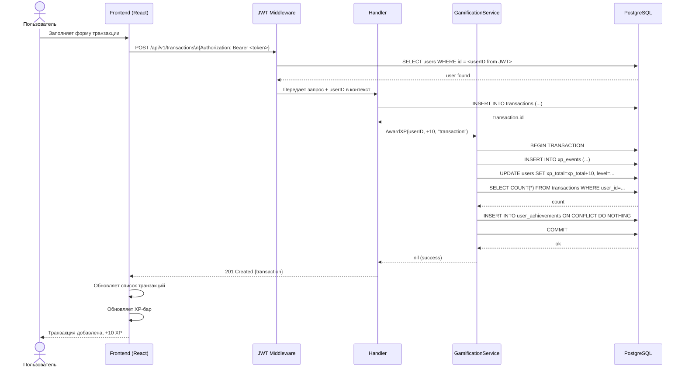
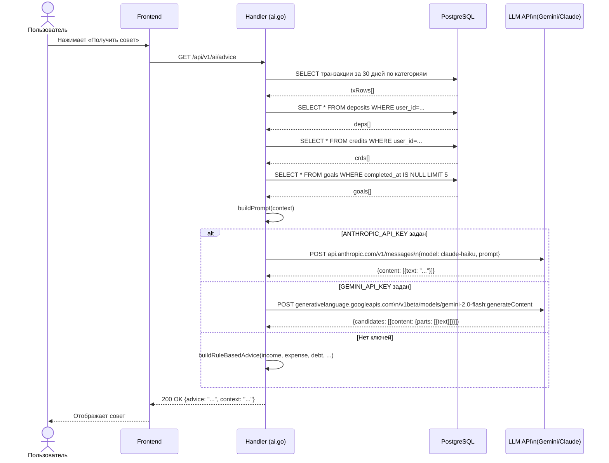
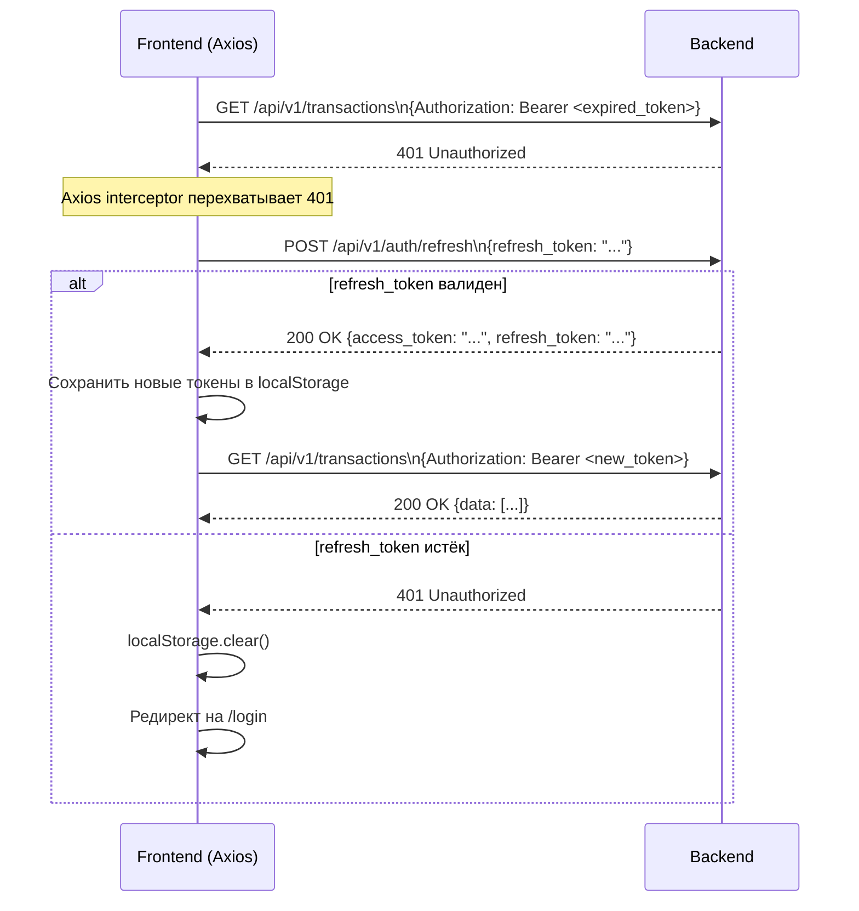

# Диаграмма последовательности (Sequence Diagram)

## Сценарий 1 — Добавление транзакции с начислением XP

---

## Сценарий 2 — Получение AI-совета

---

## Сценарий 3 — Автообновление JWT токена

