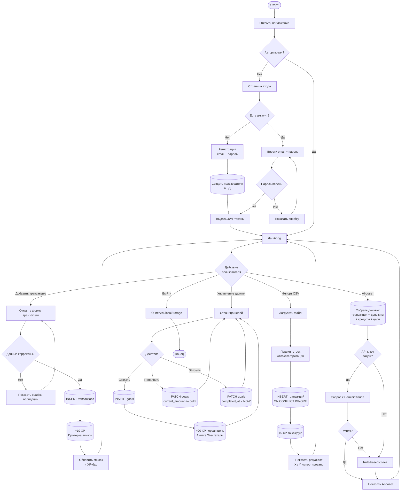
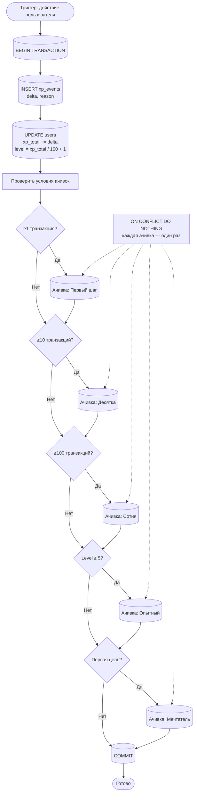

# Диаграмма деятельности (Activity Diagram)

## Основной процесс: Управление личными финансами

```mermaid
flowchart TD
    Start([Старт]) --> Open[Открыть приложение]
    Open --> Auth{Авторизован?}

    Auth -- Нет --> Login[Страница входа]
    Login --> HasAccount{Есть аккаунт?}
    HasAccount -- Нет --> Register[Регистрация\nemail + пароль]
    Register --> SaveUser[(Создать пользователя\nв БД)]
    SaveUser --> IssueToken[Выдать JWT токены]
    HasAccount -- Да --> DoLogin[Ввести email + пароль]
    DoLogin --> ValidCreds{Пароль верен?}
    ValidCreds -- Нет --> ErrLogin[Показать ошибку]
    ErrLogin --> DoLogin
    ValidCreds -- Да --> IssueToken
    IssueToken --> Dashboard

    Auth -- Да --> Dashboard[Дашборд]

    Dashboard --> Action{Действие\nпользователя}

    Action -- Добавить транзакцию --> TxForm[Открыть форму транзакции]
    TxForm --> ValidTx{Данные корректны?}
    ValidTx -- Нет --> TxError[Показать ошибки валидации]
    TxError --> TxForm
    ValidTx -- Да --> SaveTx[(INSERT transactions)]
    SaveTx --> AwardXP[(+10 XP\nПроверка ачивок)]
    AwardXP --> UpdateUI[Обновить список\nи XP-бар]
    UpdateUI --> Dashboard

    Action -- Импорт CSV --> UploadCSV[Загрузить файл]
    UploadCSV --> ParseCSV[Парсинг строк\nАвтокатегоризация]
    ParseCSV --> SaveBatch[(INSERT транзакций\nON CONFLICT IGNORE)]
    SaveBatch --> AwardBatch[(+5 XP за каждую)]
    AwardBatch --> ShowResult[Показать результат\nX / Y импортировано]
    ShowResult --> Dashboard

    Action -- Управление целями --> GoalsPage[Страница целей]
    GoalsPage --> GoalAction{Действие}
    GoalAction -- Создать --> CreateGoal[(INSERT goals)]
    CreateGoal --> FirstGoalXP[(+20 XP первая цель\nАчивка 'Мечтатель')]
    FirstGoalXP --> GoalsPage
    GoalAction -- Пополнить --> UpdateGoal[(PATCH goals\ncurrent_amount += delta)]
    UpdateGoal --> GoalsPage
    GoalAction -- Закрыть --> CloseGoal[(PATCH goals\ncompleted_at = NOW)]
    CloseGoal --> GoalsPage

    Action -- AI-совет --> CollectContext[(Собрать данные:\nтранзакции + депозиты\n+ кредиты + цели)]
    CollectContext --> HasKey{API ключ\nзадан?}
    HasKey -- Да --> CallLLM[Запрос к Gemini/Claude]
    CallLLM --> LLMok{Успех?}
    LLMok -- Да --> ShowAdvice[Показать AI-совет]
    LLMok -- Нет --> FallbackAdvice[Rule-based совет]
    HasKey -- Нет --> FallbackAdvice
    FallbackAdvice --> ShowAdvice
    ShowAdvice --> Dashboard

    Action -- Выйти --> Logout[Очистить localStorage]
    Logout --> End([Конец])
```

---

## Процесс начисления XP и ачивок

```mermaid
flowchart TD
    Trigger([Триггер: действие пользователя]) --> Begin[(BEGIN TRANSACTION)]
    Begin --> InsertXP[(INSERT xp_events\ndelta, reason)]
    InsertXP --> UpdateUser[(UPDATE users\nxp_total += delta\nlevel = xp_total / 100 + 1)]
    UpdateUser --> CheckAch[Проверить условия ачивок]

    CheckAch --> C1{≥1 транзакция?}
    C1 -- Да --> A1[(Ачивка: Первый шаг)]
    C1 -- Нет --> C2

    A1 --> C2{≥10 транзакций?}
    C2 -- Да --> A2[(Ачивка: Десятка)]
    C2 -- Нет --> C3

    A2 --> C3{≥100 транзакций?}
    C3 -- Да --> A3[(Ачивка: Сотня)]
    C3 -- Нет --> C4

    A3 --> C4{Level ≥ 5?}
    C4 -- Да --> A4[(Ачивка: Опытный)]
    C4 -- Нет --> C5

    A4 --> C5{Первая цель?}
    C5 -- Да --> A5[(Ачивка: Мечтатель)]
    C5 -- Нет --> Commit

    A5 --> Commit[(COMMIT)]
    Commit --> End([Готово])

    note1[ON CONFLICT DO NOTHING\nкаждая ачивка — один раз] -.-> A1
    note1 -.-> A2
    note1 -.-> A3
    note1 -.-> A4
    note1 -.-> A5
```
