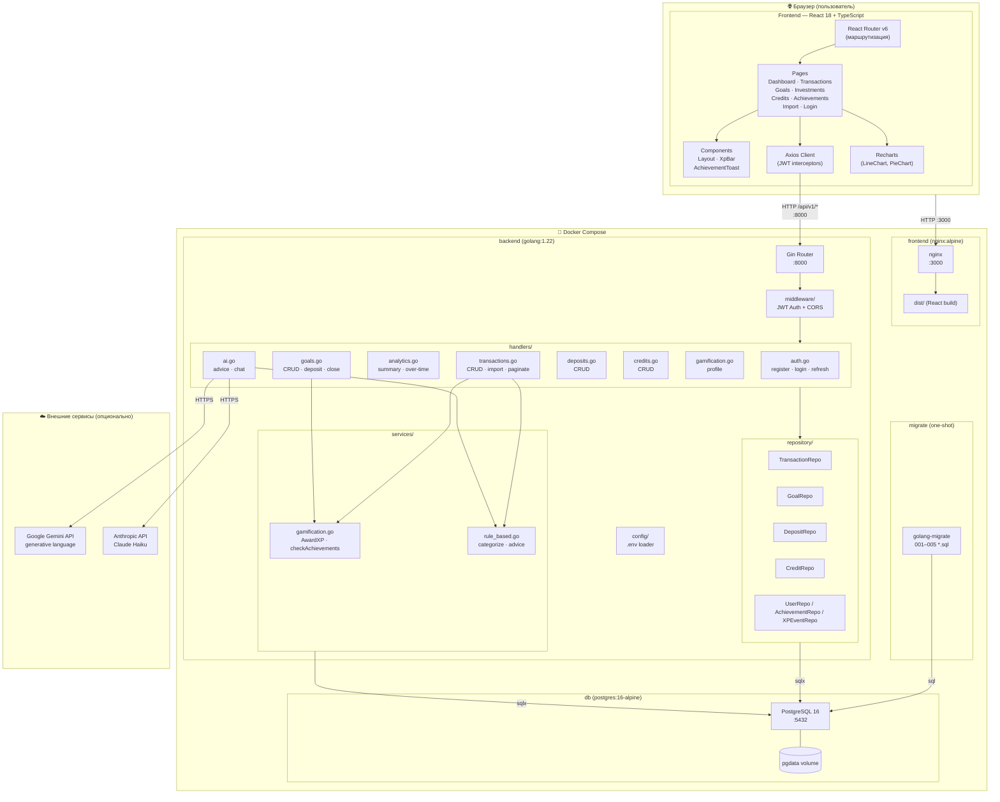

# Диаграмма компонентов (Component Diagram)

## Описание компонентов

| Компонент | Технология | Ответственность |
|-----------|-----------|----------------|
| **nginx** | nginx:alpine | Раздача статических файлов React, reverse proxy к API |
| **Gin Router** | gin-gonic/gin | HTTP маршрутизация, группировка по префиксу `/api/v1` |
| **JWT Middleware** | golang-jwt/jwt/v5 | Проверка Bearer токена, установка `userID` в контекст |
| **CORS Middleware** | gin-contrib/cors | Разрешает запросы с localhost:5173 / localhost:3000 |
| **repository/** | squirrel + sqlx | Типизированный доступ к БД через интерфейсы репозиториев |
| **handlers/** | Go | Разбор запросов, вызов репозиториев, формирование JSON-ответов |
| **GamificationService** | Go | XP, уровни, проверка и выдача ачивок (атомарно в транзакции БД) |
| **RuleBasedService** | Go | Категоризация CSV по ключевым словам, fallback AI-советы |
| **Axios Client** | axios + interceptors | JWT в заголовках, автообновление токена при 401 |
| **React Router** | react-router-dom v6 | SPA-маршрутизация, защита маршрутов через `RequireAuth` |
| **Recharts** | recharts | LineChart (динамика) и PieChart (категории расходов) |
| **golang-migrate** | migrate/migrate | Применение SQL-миграций при старте |
| **PostgreSQL** | postgres:16-alpine | Хранение всех данных, именованный volume `pgdata` |
