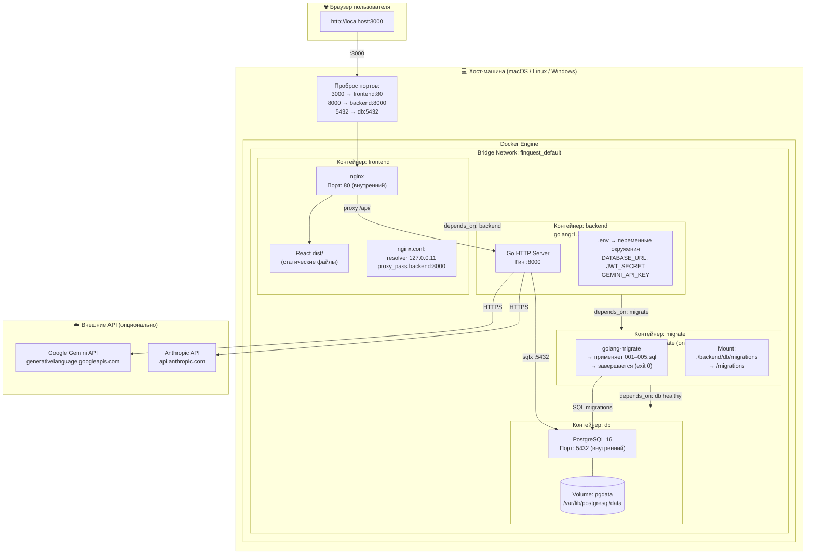
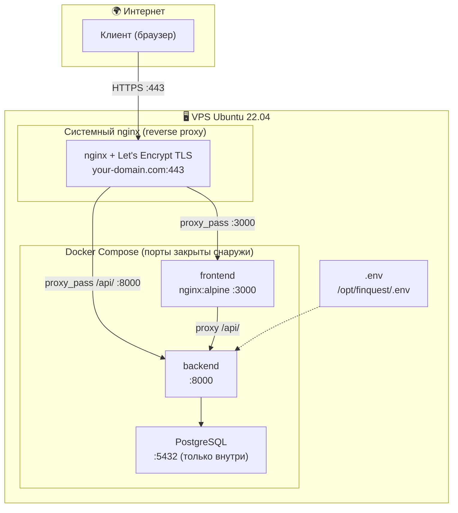
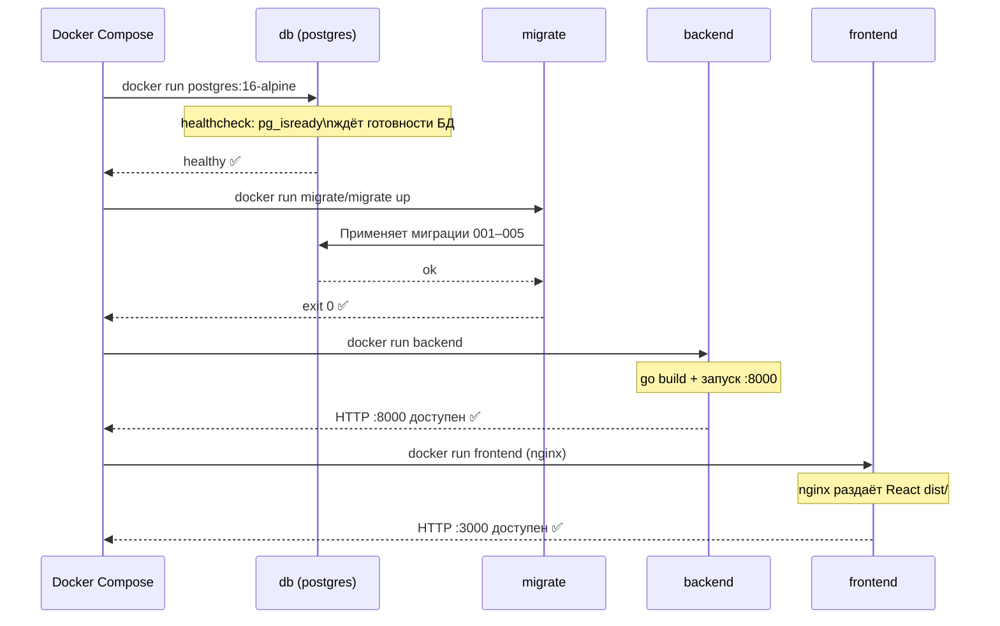

# Диаграмма развёртывания (Deployment Diagram)

## Локальное развёртывание (Docker Compose)

---

## Продакшн-развёртывание (VPS + внешний nginx)

---

## Порядок запуска контейнеров

## Требования к окружению

| Компонент | Минимальные требования | Рекомендуемые |
|-----------|----------------------|---------------|
| Docker Engine | 24+ | 26+ |
| Docker Compose | 2.x (plugin) | 2.x |
| RAM | 512 MB | 1 GB |
| CPU | 1 vCPU | 2 vCPU |
| Диск | 2 GB | 5 GB |
| ОС | Linux / macOS / Windows (WSL2) | Ubuntu 22.04 |
| Открытые порты | 3000, 8000 | 3000, 8000 |
