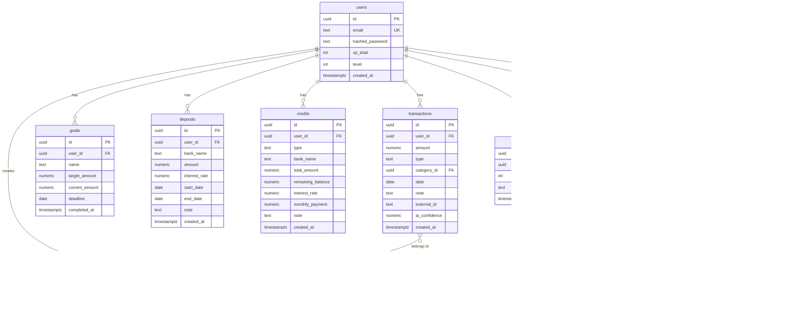

# ER-диаграмма / Схема базы данных

## Entity-Relationship Diagram

---

## Описание таблиц

| Таблица | Строк (демо) | Описание |
|---------|:-----------:|----------|
| `users` | 1+ | Учётные записи. `xp_total` и `level` обновляются атомарно через `GamificationService` |
| `categories` | 8 системных + пользовательские | Системные (is_system=true) создаются миграцией: Еда, Транспорт, ЖКХ, Здоровье, Развлечения, Одежда, Зарплата, Прочее |
| `transactions` | 100+ (демо) | Доходы/расходы. `external_id` обеспечивает идемпотентность при CSV-импорте |
| `goals` | 3 (демо) | Финансовые цели. `completed_at IS NULL` = активная цель |
| `deposits` | 3 (демо) | Банковские вклады. Годовой доход = `amount × interest_rate / 100` |
| `credits` | 2 (демо) | Кредиты и карты. `type` ∈ {consumer, card} |
| `achievements` | 6 | Статические записи, созданные миграцией: коды first_transaction, ten_transactions, hundred_transactions, level_5, first_goal, first_import |
| `user_achievements` | — | Связь M:M с уникальностью (user_id, achievement_id) — ачивка выдаётся один раз |
| `xp_events` | — | Лог всех начислений XP: дельта и причина |
| `challenges` | — | Задания (зарезервировано для будущих версий) |
| `user_challenges` | — | Прогресс по заданиям (зарезервировано) |

---

## Ключевые ограничения

| Таблица | Ограничение | Назначение |
|---------|------------|------------|
| `users.email` | UNIQUE | Запрет дублей |
| `transactions.(user_id, external_id)` | UNIQUE | Идемпотентный импорт CSV |
| `user_achievements.(user_id, achievement_id)` | UNIQUE | Каждая ачивка — один раз |
| `transactions.type` | CHECK IN ('income','expense') | Валидация на уровне БД |
| `credits.type` | CHECK IN ('consumer','card') | Валидация типа кредита |
| `deposits.amount` | CHECK > 0 | Сумма должна быть положительной |
| `credits.total_amount` | CHECK > 0 | Лимит/сумма кредита > 0 |
| `categories.user_id → users.id` | ON DELETE CASCADE | Удаление пользователя удаляет его категории |
| `transactions.category_id → categories.id` | ON DELETE SET NULL | Удаление категории не удаляет транзакции |
